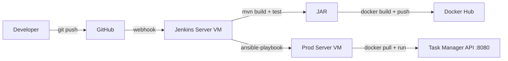

# Task Manager — CI/CD Pipeline Capstone

A RESTful Task Management API built with Spring Boot, deployed through a fully automated CI/CD pipeline — every `git push` to `main` results in a live, updated deployment on Azure with zero manual steps.

**Status: ✅ Live and fully operational.** The pipeline has been verified end-to-end through multiple real deployments, including debugging and resolving SSH authentication, Java version mismatches, and health-check endpoint issues along the way.

## What this project demonstrates

This is an end-to-end DevOps pipeline covering the full path from source code to a running production service:

```
git push → GitHub webhook → Jenkins → Maven build & test
→ Docker image build & push → Ansible deploy → Live on Azure VM
```

Every stage is automated. A single `git push` triggers the entire chain, including build verification, containerisation, and a health-check-gated deployment.

## Architecture

| Component | Role |
|---|---|
| **Spring Boot + H2** | The application — REST API with JPA persistence |
| **Maven** | Compiles the code, runs JUnit tests, packages the `.jar` |
| **Docker** | Containerises the built `.jar` into a portable image |
| **Docker Hub** | Stores versioned images, tagged by Jenkins build number |
| **Jenkins** | Orchestrates the pipeline — triggered by a GitHub webhook on every push |
| **Ansible** | SSHes into the production VM, pulls the new image, and redeploys the container |
| **Azure VMs** | Two Ubuntu 22.04 VMs — one running Jenkins, one running the live app |

Two Azure VMs are used:
- **jenkins-server** — runs Jenkins, Docker, and Ansible (the CI/CD control plane)
- **prod-server** — runs the actual application container, reachable on port 8080



## Project Structure

```
task-manager-cicd/
├── src/main/java/com/devops/taskmanager/
│   ├── Task.java               # JPA entity — id, title, completed
│   ├── TaskRepository.java     # Spring Data JPA repository
│   ├── TaskController.java     # REST controller — GET, POST, PUT, DELETE on /tasks
│   └── HealthController.java   # /health → {"status": "UP"}
├── src/main/resources/
│   └── application.properties  # H2 in-memory DB config
├── Dockerfile                  # eclipse-temurin:21-jre-alpine base image
├── Jenkinsfile                 # 5-stage declarative pipeline
├── ansible/
│   ├── deploy.yml              # Deployment playbook
│   └── inventory               # Production host definition
└── README.md
```

## API Endpoints

| Method | Endpoint | Description |
|---|---|---|
| `GET` | `/tasks` | Fetch all tasks |
| `POST` | `/tasks` | Create a new task |
| `PUT` | `/tasks/{id}` | Update / mark a task complete |
| `DELETE` | `/tasks/{id}` | Delete a task |
| `GET` | `/health` | Health check — used by Ansible to verify deployment |

## Pipeline Stages

The `Jenkinsfile` defines five stages, run in order on every push to `main`:

1. **Checkout** — pulls the latest code from GitHub
2. **Build** — `mvn clean package -DskipTests`
3. **Test** — `mvn test`, results published via JUnit reporting
4. **Docker Build & Push** — builds the image, tags it with the Jenkins build number, pushes to Docker Hub
5. **Deploy** — runs the Ansible playbook over SSH, which pulls the new image, replaces the running container, and polls `/health` until it returns `200 OK`

If any stage fails, the pipeline stops and the previous deployment on `prod-server` is left untouched — there's no partial-deploy risk since the old container only gets removed after the new image has already been pulled successfully.

On both success and failure, the pipeline's `post` block sends a **Slack notification** and an **email** with the build status and a link to the console output — so a deployment failure is known immediately, not discovered later.

## Tech Stack

- **Backend:** Spring Boot 3.5.0, Spring Data JPA, H2 (in-memory)
- **Language runtime:** Java 21 (build and container runtime matched)
- **Testing:** JUnit 5
- **CI/CD:** Jenkins (Declarative Pipeline)
- **Notifications:** Slack (Incoming Webhooks) + Email (Email Extension Plugin), triggered on build success/failure
- **Containerisation:** Docker (`eclipse-temurin:21-jre-alpine`), Docker Hub
- **Infrastructure Automation:** Ansible (agentless, SSH-based)
- **Cloud:** Microsoft Azure (Ubuntu 22.04 VMs, Standard_B1s/B2s)

## Running Locally

```bash
mvn clean package
java -jar target/task-manager-0.0.1-SNAPSHOT.jar
```

The app starts on `http://localhost:8080`.

```bash
curl http://localhost:8080/health
# { "status": "UP" }

curl http://localhost:8080/tasks
# []
```

## Running via Docker

```bash
mvn clean package -DskipTests
docker build -t task-manager:local .
docker run -p 8080:8080 task-manager:local
```

## CI/CD Setup Summary

1. Jenkins job is configured as a Pipeline job, pointed at this repo's `Jenkinsfile` via "Pipeline script from SCM"
2. A GitHub webhook (`/github-webhook/`) notifies Jenkins on every push to `main`
3. Docker Hub credentials and the production server's SSH key are stored in Jenkins' credential manager — never hardcoded in the pipeline
4. The Ansible inventory (`ansible/inventory`) points at the production VM, using key-based SSH authentication
5. Deployment is verified automatically — the pipeline only reports success once `/health` responds with `200 OK` on the production server
6. Build status is pushed to a Slack channel via an Incoming Webhook (configured as a Jenkins Secret text credential) and to email via the Email Extension plugin, both triggered from the pipeline's `post` block

## What I learned building this

- Writing declarative Jenkins pipelines and wiring them to GitHub via webhooks
- Managing SSH key-based authentication between Jenkins and remote servers — including diagnosing a malformed private key (missing `BEGIN`/`END` markers from a copy-paste error) that caused a `libcrypto` parsing failure in `ssh-add`
- Resolving a `UnsupportedClassVersionError` caused by a mismatch between the JDK used to compile the JAR (Java 21) and the JRE in the Docker base image (originally Java 17) — fixed by aligning both to Java 21
- Diagnosing a Docker container crash loop using `docker ps -a` and `docker logs`, rather than assuming the deployment itself had failed
- Catching a health-check endpoint mismatch (`/actuator/health` vs. the app's actual custom `/health` endpoint) that caused the pipeline to fail even after a successful deployment
- Using Ansible for agentless, idempotent deployment automation, with `ignore_errors` for safe first-time deploys and a retry-based `uri` health check to gate pipeline success on the app actually being reachable
- Structuring a CI/CD pipeline so failures fail safely without taking down the existing production deployment


*Built as a hands-on DevOps capstone project covering Jenkins, Maven, Docker, Ansible, and Azure.*
