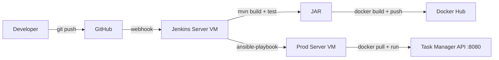

# DevOps Capstone Project — Implementation Plan

> **Spring Boot + Jenkins + Docker + Ansible + Azure**
> Task Manager REST API with fully automated CI/CD pipeline

---

## Progress Overview

| Phase | Task | Status | Time Est. |
|-------|------|--------|-----------|
| 1 | Local environment setup | ✅ Done | — |
| 2 | Build Spring Boot app | ✅ Done | — |
| 3 | Containerise the app (Docker) | ✅ Done | — |
| 4 | Set up Azure Virtual Machines | ⬜ Pending (Manual) | 1–2 hrs |
| 5 | Configure Jenkins | ⬜ Pending (Manual) | 1–2 hrs |
| 6 | Write pipeline files | ✅ Done | — |
| 7 | Wire Jenkins to GitHub | ⬜ Pending (Manual) | 30 min |
| 8 | Run and verify | ⬜ Pending | 30 min |
| 9 | Resume & GitHub polish | ✅ Done | 30 min |

---

## Phase 1–2 — Completed ✅

### What was built
- Spring Boot 3.5.0 / Java 17 / Maven project scaffolded from `start.spring.io`
- **5 source files** created:

| File | Purpose |
|------|---------|
| [Task.java](file:///c:/Users/KIIT0001/Desktop/own/cicd/src/main/java/com/devops/taskmanager/Task.java) | JPA entity — `id`, `title`, `completed` |
| [TaskRepository.java](file:///c:/Users/KIIT0001/Desktop/own/cicd/src/main/java/com/devops/taskmanager/TaskRepository.java) | Spring Data JPA repository |
| [TaskController.java](file:///c:/Users/KIIT0001/Desktop/own/cicd/src/main/java/com/devops/taskmanager/TaskController.java) | REST controller — GET, POST, PUT, DELETE on `/tasks` |
| [HealthController.java](file:///c:/Users/KIIT0001/Desktop/own/cicd/src/main/java/com/devops/taskmanager/HealthController.java) | `/health` → `{"status": "UP"}` |
| [application.properties](file:///c:/Users/KIIT0001/Desktop/own/cicd/src/main/resources/application.properties) | H2 in-memory DB config |

- **3 JUnit tests** — all passing ✅
- JAR built: `target/task-manager-0.0.1-SNAPSHOT.jar`

---

## Phase 3 — Containerise the App

### Step 7: Dockerfile
#### [NEW] [Dockerfile](file:///c:/Users/KIIT0001/Desktop/own/cicd/Dockerfile)
- Base image: `eclipse-temurin:17-jre-alpine` (lightweight JRE)
- Copies the built JAR, exposes port 8080
- Entry point runs the Spring Boot app

### Step 8: Local Docker verification
```bash
mvn clean package -DskipTests
docker build -t task-manager:1.0 .
docker run -p 8080:8080 task-manager:1.0
# Verify: curl http://localhost:8080/tasks → []
```

### Step 9: Push to Docker Hub
```bash
docker tag task-manager:1.0 rudrika83/task-manager:1.0
docker login
docker push rudrika83/task-manager:1.0
```

> [!IMPORTANT]
> The current pipeline uses Docker Hub username `rudrika83`. Replace it in the Jenkinsfile if you want to push to a different account.

---

## Phase 4 — Azure Virtual Machines (Manual)

> [!NOTE]
> This phase requires manual work in the Azure Portal. Steps are documented here for reference.

### Step 10: Create 2 VMs
| VM | Name | Image | Size | Open Ports |
|----|------|-------|------|------------|
| 1 | `jenkins-server` | Ubuntu 22.04 LTS | Standard_B1s | 22, 8080, 50000 |
| 2 | `prod-server` | Ubuntu 22.04 LTS | Standard_B1s | 22, 8080 |

### Step 11: Install Jenkins on `jenkins-server`
```bash
sudo apt update
sudo apt install -y openjdk-17-jdk
wget -q -O - https://pkg.jenkins.io/debian/jenkins.io.key | sudo apt-key add -
sudo sh -c 'echo deb http://pkg.jenkins.io/debian binary/ > /etc/apt/sources.list.d/jenkins.list'
sudo apt update && sudo apt install -y jenkins
sudo systemctl start jenkins && sudo systemctl enable jenkins
```

### Step 12: Install Docker + Ansible on `jenkins-server`
```bash
sudo apt install -y docker.io ansible
sudo usermod -aG docker jenkins
sudo systemctl restart jenkins
```

### Step 13: Install Docker on `prod-server`
```bash
sudo apt update && sudo apt install -y docker.io
sudo systemctl start docker && sudo systemctl enable docker
```

---

## Phase 5 — Configure Jenkins (Manual)

### Step 14: Add credentials
| Credential | Type | Jenkins ID |
|------------|------|------------|
| Docker Hub | Username + Password | `dockerhub-creds` |
| Prod server SSH | SSH Private Key | `prod-server-ssh` |

### Step 15: Install plugins
- Git, Maven Integration, Pipeline, Docker Pipeline, Ansible, SSH Agent, Credentials Binding

### Step 16: Configure Maven
- Manage Jenkins → Tools → Maven → Add Maven → Name: `Maven3` → Auto-install

---

## Phase 6 — Pipeline Files

### Step 17: Jenkinsfile
#### [NEW] [Jenkinsfile](file:///c:/Users/KIIT0001/Desktop/own/cicd/Jenkinsfile)
- 5-stage pipeline: Checkout → Build → Test → Docker Build & Push → Deploy
- Uses `dockerhub-creds` for Docker Hub authentication
- Triggers Ansible playbook for deployment

### Step 18: Ansible deploy playbook
#### [NEW] [ansible/deploy.yml](file:///c:/Users/KIIT0001/Desktop/own/cicd/ansible/deploy.yml)
- Pulls Docker image on prod server
- Stops/removes old container, starts new one
- Health check verification with retries

### Step 19: Ansible inventory
#### [NEW] [ansible/inventory](file:///c:/Users/KIIT0001/Desktop/own/cicd/ansible/inventory)
- Defines `prod` host group pointing to prod-server VM

---

## Phase 7 — Wire Jenkins to GitHub (Manual)

### Step 20: Create Jenkins Pipeline job
- New Item → Pipeline → `task-manager-pipeline`
- SCM: Git → repo URL → branch `*/main` → Script Path: `Jenkinsfile`

### Step 21: GitHub webhook
- Repo → Settings → Webhooks → Add
- Payload URL: `http://<jenkins-ip>:8080/github-webhook/`
- Trigger: Push events

---

## Phase 8 — Verify

### Step 22–23: End-to-end test
```bash
# Push a commit → Jenkins auto-triggers → all 5 stages green
curl http://<prod-server-ip>:8080/health   # {"status":"UP"}
curl http://<prod-server-ip>:8080/tasks    # []
```

---

## Phase 9 — README & Resume Polish

### Step 25: README.md
#### [NEW] [README.md](file:///c:/Users/KIIT0001/Desktop/own/cicd/README.md)
- App description, architecture diagram, pipeline stages
- Local run instructions, live API endpoint

### Step 26: Resume bullet
> Built and deployed a RESTful Task Management API using Spring Boot; implemented end-to-end CI/CD pipeline with Jenkins, Maven, Docker, and Ansible on Microsoft Azure VMs — automated from git push to live deployment.

---

## Architecture



## Open Questions

> [!IMPORTANT]
> **Docker Hub username**: The current pipeline uses `rudrika83` in the `Jenkinsfile` and passes it into `ansible/deploy.yml`. Change `DOCKER_USER` in the `Jenkinsfile` if you want to publish under a different Docker Hub account.

> [!IMPORTANT]
> **Azure VM IPs**: `ansible/inventory` currently points to `20.204.40.129` as `azureuser`. Update that host if your prod-server public IP changes.
